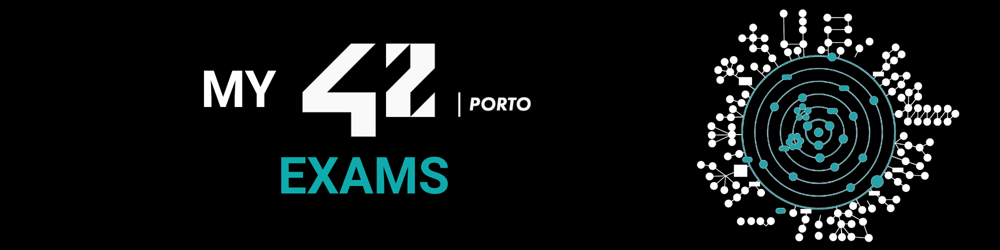

# 📝 Exams

Exam study materials for the **42 Porto Common Core**, with full solutions and subjects for every exercise.

---

## 🗂️ Overview

| Exam | Rank | Description |
|---|---|---|
| [M2 - Exam](./M2%20-%20Exam/) | 2 | Exam Rank 02 — C programming exercises across 4 difficulty levels |
| [M3 - Exam](./M3%20-%20Exam/) | 3 | Exam Rank 03 — Python programming exercises across 6 difficulty levels |

---

## 📋 Structure

Each exam folder is organised by difficulty level. Inside every exercise folder you will find:

- `subject.txt` — the original exam subject with examples
- A complete, working solution (`.c`/`.h`, **norminette-compliant**, for Rank 02; `.py` for Rank 03)

---

## ⚠️ Exam rules reminder

- **No internet** access during the exam.
- You are given a **random exercise** from a specific level (one per level cleared).
- C exercises must compile cleanly with `gcc -Wall -Wextra -Werror`; norminette is **not** enforced during the exam, but clean code is a good habit.
- Time limit is typically **3 hours**.
