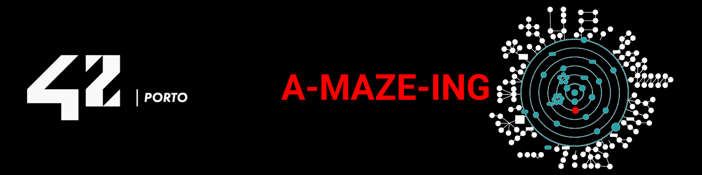

<div align="center">


# 😎 M2 – A-Maze-ing


<br/>


This project is part of the **42cursus** at 42 Porto, done in a team of two (dsilva-c, dasantos).
A-Maze-ing is a Python maze generator that builds a valid maze from a configuration file, writes the required hex-encoded output, and provides a visual frontend in the terminal or with MiniLibX. The program supports seeded generation, perfect and non-perfect modes, and an embedded "42" pattern when the maze size allows it.

</div>

---

## 🎯 Objectives

- Generate a valid maze (perfect or non-perfect) from a plain-text configuration file.
- Produce the required hex-encoded output format, with a BFS-computed shortest path.
- Provide a visual frontend in ASCII and, optionally, MiniLibX (MLX).
- Support seeded, reproducible generation and an embedded "42" pixel pattern.
- Package the core generation/solving logic as a reusable, typed Python library (`mazegen`).

---

## 🧱 Project structure

```text
A-Maze-ing/
├── a_maze_ing.py          # Entry point: loads config, generates, solves, renders
├── config_parser.py       # KEY=VALUE config file parsing and validation
├── generator.py           # Maze generation (DFS/Prim's/Kruskal's)
├── solver.py              # BFS shortest-path solver
├── output_writer.py       # Hex-encoded output file writer
├── output_validator.py    # Validates a generated output file
├── export_svg.py          # Optional SVG export
├── renderer_ascii.py      # Terminal renderer
├── renderer_mlx.py        # MiniLibX renderer (bonus)
├── mazegen/               # Standalone, PEP 561-typed reusable library
│   ├── generator.py
│   ├── maze.py
│   └── solver.py
├── tests/                 # pytest suite (config, generator, output, renderer, solver)
├── COMMANDS.md            # Every command/key binding and where it's implemented
├── Makefile                # install | run | debug | lint | lint-strict | test | build | clean
└── config.txt              # Example configuration
```

---

## 🚀 Instructions

### Setup

```bash
python3 -m venv .venv
source .venv/bin/activate
make install
```

### Run

```bash
python3 a_maze_ing.py config.txt
```

### MLX (optional, for the graphical renderer)

The MLX wheels are 42-provided binaries and aren't included in this repo — grab
them from the 42 MiniLibX distribution for your OS, then install locally:

```bash
# Ubuntu
pip install ./mlx-2.2-py3-ubuntu-any.whl

# Fedora
pip install ./mlx-2.2-py3-fedora-any.whl
```

Without MLX, the program still runs fully in ASCII mode (`DISPLAY_MODE=ascii`,
the default).

### Visual controls

Required controls (subject):

ASCII menu:
- 1: Re-generate a new maze
- 2: Show/Hide path from entry to exit
- 3: Rotate maze wall colours
- 4: Toggle 42 pattern highlight
- 5: Cycle path animation speed
- 6: Cycle effects speed
- 7: Toggle ducks
- 8: Toggle duck animation
- 9: Toggle auto palette
- 10: Toggle entry/exit pulse
- 11: Toggle 42 pattern fade
- 12: Toggle dead-end shimmer
- 13: Toggle stats ticker
- 14: Toggle seed slideshow
- 15: Faster path animation
- 16: Slower path animation
- 17: Faster effects
- 18: Slower effects
- 19: Quit

MLX keys (window focused):
- R: Re-generate a new maze
- P: Show/Hide path from entry to exit
- C: Cycle wall colours
- H: Toggle 42 pattern highlight
- S: Cycle path animation speed
- E: Cycle effects speed
- [: Slower path animation
- ]: Faster path animation
- -: Slower effects
- =: Faster effects
- D: Toggle ducks
- U: Toggle duck animation
- A: Toggle auto palette
- O: Toggle entry/exit pulse
- F: Toggle 42 pattern fade
- M: Toggle dead-end shimmer
- T: Toggle stats ticker
- L: Toggle seed slideshow
- Q or Esc: Quit

Bonus controls (extra commands):

- `D`/`U`: ducks on/off and duck animation (MLX)
- `A`/`O`/`F`/`M`: palette, pulse, fade, shimmer (MLX)
- `T`/`L`: stats ticker and seed slideshow (MLX)
- Menu options 7–14: duck/effect toggles (ASCII)
- Menu options 15–18: faster/slower path and effects (ASCII)

Notes:
- `S` replays the path reveal so speed changes are immediately visible.
- `[`/`]` and `-`/`=` give slower/faster adjustments without cycling.
- Ducks never spawn on the solution path or inside the 42 pattern.

---

## 🧠 Maze generation algorithm

A-Maze-ing uses the **DFS Recursive Backtracker** (also known as the
Randomised Depth-First Search) algorithm to generate the maze.

Additional algorithms are available via `ALGORITHM`:
- `prims` uses randomized Prim's to grow a maze from a frontier.
- `kruskals` uses randomized Kruskal's with union-find to build a spanning tree.

### How it works

The algorithm treats the grid as a graph where every cell is a node. It
starts from a random (or seeded) cell and explores the graph with a
depth-first search, carving passages as it goes.

```
Initialise:   mark every cell as unvisited, all walls closed
Choose start: push start cell onto the stack, mark as visited

Loop:
  current ← top of stack
  neighbours ← unvisited adjacent cells of current (in random order)

  if neighbours is not empty:
      choose a random unvisited neighbour
      remove the wall between current and that neighbour
      push the neighbour onto the stack
      mark the neighbour as visited
  else:
      pop current from the stack   ← backtrack

Stop when the stack is empty (all reachable cells have been visited)
```

After the spanning tree is complete, the **"42" pixel pattern** is
pre-burned into the grid: a set of cells whose combined silhouette spells
"42" in a 5×7 pixel font are locked to all-walls-closed (`0xF`) and
skipped entirely by the DFS. Isolated regions created by the pattern are
reconnected by a greedy bridge pass.

In **non-perfect** mode, 15 % of remaining internal walls are opened at
random, creating loops, then a final repair pass eliminates any fully-open
3×3 block (which would be trivially solved and score-penalised).

### Why DFS Recursive Backtracker?

| Property | Reason it matters here |
|---|---|
| **Simplicity** | Easy to implement iteratively (no recursion-limit risk). |
| **Perfect maze guarantee** | Every cell is reachable from every other — exactly one path between any pair. Trivially extendable to non-perfect by reopening random walls. |
| **Deterministic with seed** | Set `SEED=N` in `config.txt` and reproduce any maze exactly. |
| **Good visual aesthetic** | DFS produces long, winding corridors — visually interesting in both ASCII and MLX renders. |
| **Pattern-friendly** | The iterative stack makes it straightforward to pre-mark the "42" cells as off-limits and reconnect any orphaned regions. |

---

## ➕ Bonus features

Beyond the mandatory ASCII maze generator, the following are all optional
(bonus) and never change the required output file format:

- **Extra generation algorithms** — `ALGORITHM=prims` (randomized Prim's) and
  `ALGORITHM=kruskals` (randomized Kruskal's with union-find), alongside the
  mandatory DFS Recursive Backtracker.
- **Non-perfect mode** (`PERFECT=False`) — opens extra passages to create
  loops instead of a strict spanning tree.
- **MLX graphical renderer** — a full MiniLibX window (`DISPLAY_MODE=mlx` or
  `both`) alongside the mandatory terminal/ASCII view, with its own key
  bindings (see **Visual controls** above).
- **Visual effects and toggles** — path/entry-exit animations, wall-colour
  palettes (including an auto-cycling palette), a "42" pattern fade, dead-end
  shimmer, a stats ticker, a seed slideshow, and a rubber-duck overlay — all
  configurable via the optional keys in **Configuration file** below.
- **SVG export** (`EXPORT_SVG=<path>`) — renders the maze to a standalone
  vector image via `export_svg.py`.
- **Reusable `mazegen` library** — the core generator/solver is packaged as
  a standalone, pip-installable, PEP 561-typed library, independent of the
  CLI entry point (see **Reusable library** below).

---

## 📦 Reusable library — `mazegen`

The core generation logic is packaged as a standalone, PEP 561-typed Python
library (`mazegen/`). It can be imported and used independently of the
project's entry point.

### Installation

```bash
# From the project root — installs in editable mode (no wheel needed):
pip install -e .

# Or install the built wheel:
pip install mazegen-1.0.0-py3-none-any.whl
```

### Quick-start example

```python
from mazegen import MazeGenerator, MazeSolver

# Generate a 20×15 perfect maze, reproducible with seed 42
gen = MazeGenerator(width=20, height=15, seed=42)
grid = gen.generate(entry=(0, 0), exit_=(19, 14))

# Access the hex grid
for row in grid.cells:
    print("".join(cell.hex_char() for cell in row))

# BFS shortest path (list of 'N'/'E'/'S'/'W' direction strings)
solver = MazeSolver(grid)
directions = solver.solve()
print("Path:", "".join(directions))

# Cell coordinates along the path
path_cells = solver.get_path_cells()
```

### Custom parameters

| Parameter | Type | Default | Description |
|---|---|---|---|
| `width` | `int` | — | Number of columns (≥ 2). |
| `height` | `int` | — | Number of rows (≥ 2). |
| `seed` | `int \| None` | `None` | RNG seed for reproducibility. `None` = non-deterministic. |
| `perfect` | `bool` | `True` | Perfect maze (spanning tree). `False` adds random extra passages. |
| `algorithm` | `str` | `"dfs"` | Generation algorithm. Allowed: `"dfs"`, `"prims"`, `"kruskals"`. |
| `entry` | `tuple[int, int]` | `(0, 0)` | Entry cell (must be on the border). |
| `exit_` | `tuple[int, int]` | `(w-1, h-1)` | Exit cell (must be on the border, ≠ entry). |

### Wall encoding

Each cell is encoded as a single hex digit (`0`–`f`):

| Bit | Direction | Value 1 (wall closed) | Value 0 (wall open) |
|---|---|---|---|
| 0 (LSB) | North | Wall present | Passage |
| 1 | East | Wall present | Passage |
| 2 | South | Wall present | Passage |
| 3 (MSB) | West | Wall present | Passage |

Example: `0b0110` = `0x6` means East and South walls are closed; North and West walls are open.

---

## ⚙️ Configuration file

The program reads a plain-text `KEY=VALUE` file (default: `config.txt`).
Lines starting with `#` and blank lines are ignored.

### Mandatory keys

| Key | Type | Constraint | Example |
|---|---|---|---|
| `WIDTH` | `int` | ≥ 2 | `WIDTH=20` |
| `HEIGHT` | `int` | ≥ 2 | `HEIGHT=15` |
| `ENTRY` | `x,y` | On border of grid, ≠ EXIT | `ENTRY=0,0` |
| `EXIT` | `x,y` | On border of grid, ≠ ENTRY | `EXIT=19,14` |
| `OUTPUT_FILE` | `str` | Any writable path | `OUTPUT_FILE=maze.txt` |
| `PERFECT` | `True`/`False` | Exact spelling | `PERFECT=True` |

### Optional keys

| Key | Type | Default | Allowed values | Example |
|---|---|---|---|---|
| `SEED` | `int` or `None` | `None` | Any integer or `None` | `SEED=42` |
| `ALGORITHM` | `str` | `dfs` | `dfs`, `prims`, `kruskals` | `ALGORITHM=dfs` |
| `DISPLAY_MODE` | `str` | `ascii` | `ascii`, `mlx`, `both` | `DISPLAY_MODE=both` |
| `ANIMATE` | `True`/`False` | `False` | Exact spelling | `ANIMATE=False` |
| `PALETTE` | `str` | `default` | `default`, `colorblind` | `PALETTE=colorblind` |
| `EXPORT_SVG` | `str` | `None` | SVG output path | `EXPORT_SVG=maze.svg` |
| `EXPORT_CELL_SIZE` | `int` | `24` | ≥ 1 | `EXPORT_CELL_SIZE=24` |
| `EXPORT_WALL` | `int` | `2` | ≥ 1 | `EXPORT_WALL=2` |
| `DUCKS` | `True`/`False` | `False` | Exact spelling | `DUCKS=True` |
| `DUCKS_COUNT` | `int` | `0` | ≥ 1 | `DUCKS_COUNT=5` |
| `DUCKS_ANIMATE` | `True`/`False` | `False` | Exact spelling | `DUCKS_ANIMATE=True` |
| `AUTO_PALETTE` | `True`/`False` | `False` | Exact spelling | `AUTO_PALETTE=True` |
| `PULSE_ENTRY_EXIT` | `True`/`False` | `False` | Exact spelling | `PULSE_ENTRY_EXIT=True` |
| `PATTERN_FADE` | `True`/`False` | `False` | Exact spelling | `PATTERN_FADE=True` |
| `DEAD_END_SHIMMER` | `True`/`False` | `False` | Exact spelling | `DEAD_END_SHIMMER=True` |
| `SEED_SLIDESHOW` | `True`/`False` | `False` | Exact spelling | `SEED_SLIDESHOW=True` |
| `STATS_TICKER` | `True`/`False` | `False` | Exact spelling | `STATS_TICKER=True` |

When `ANIMATE=True`, the solution path animates on startup and after
regenerating a maze.

Display modes (`ascii`, `mlx`, `both`) and animation are optional bonus
features that do not change the required output file format.

### Example `config.txt`

```ini
WIDTH=20
HEIGHT=15
ENTRY=0,0
EXIT=19,14
OUTPUT_FILE=maze.txt
PERFECT=True
SEED=42
ALGORITHM=dfs
DISPLAY_MODE=ascii
ANIMATE=False
PALETTE=default
# Optional SVG export (bonus)
# EXPORT_SVG=maze.svg
# EXPORT_CELL_SIZE=24
# EXPORT_WALL=2
# Optional rubber ducks overlay (bonus)
# DUCKS=True
# DUCKS_COUNT=5
# DUCKS_ANIMATE=False
# Optional animations (bonus)
# AUTO_PALETTE=True
# PULSE_ENTRY_EXIT=True
# PATTERN_FADE=True
# DEAD_END_SHIMMER=True
# SEED_SLIDESHOW=True
# STATS_TICKER=True
```

---

## 🧪 Testing

```bash
# Run the pytest suite (config, generator, output, renderer, solver)
make test

# Equivalent to:
python3 -m pytest tests/ -v --tb=short

# After generating a maze, also validate the output file directly:
python3 output_validator.py maze.txt
```

---

## ⚠️ Troubleshooting & known limits

Common pitfalls when extending or debugging the generator:

- **Wall-symmetry bugs**: removing a wall between two cells must clear the
  matching bit on *both* sides (e.g. clearing North on the neighbour when
  clearing South on the current cell) — a one-sided clear breaks the hex
  output and the solver.
- **Missing trailing blank line**: the output file format requires a blank
  line at the end; omitting it fails validation even if the grid is correct.
- **Path direction letters**: the solved path must only ever use `N`/`E`/`S`/`W`
  — any other character indicates a bug in the BFS backtracking step.
- **Fully-open 3×3 blocks**: in non-perfect mode, the repair pass must catch
  any 3×3 area left with all internal walls open, since it would be trivially
  solvable and is penalised.

Known limits:

- The "42" pixel pattern is skipped on mazes too small to fit the 5×7 font
  silhouette without corrupting connectivity.
- The MLX wheel must match your OS (Ubuntu vs Fedora) — installing the wrong
  one will fail to import; ASCII mode is unaffected.

### Defense Q&A

- **"How do you guarantee reproducibility?"** — The RNG is seeded once from
  `SEED` (or a random seed if unset, which is then reported), and every
  random choice in generation/pattern-bridging/non-perfect loop-opening draws
  from that single seeded `Random` instance.
- **"How do you know the maze is a perfect maze?"** — DFS Recursive
  Backtracker builds a spanning tree over the grid graph: it visits every
  cell exactly once and only removes a wall when moving to an *unvisited*
  neighbour, so the result has exactly `width*height - 1` open passages and
  no cycles — one unique path between any two cells.
- **"How do you know the solver's path is correct/shortest?"** — `MazeSolver`
  runs a breadth-first search from entry to exit over the open passages;
  BFS explores in order of increasing distance, so the first time it reaches
  the exit is guaranteed to be via a shortest path.

---

## ✅ Code style & requirements

- PEP 8 compliance enforced via `flake8` (`.flake8` config).
- Static typing checked with `mypy` (`--disallow-untyped-defs`,
  `--check-untyped-defs`; the `mazegen` library is additionally PEP 561-typed
  via `py.typed`).
- Run both with `make lint`, or `make lint-strict` for `mypy --strict`.

---

## 🛠️ Tech stack

<div align="center">

<table width="100%">
    <thead>
        <tr>
            <th width="80%">Category</th>
            <th width="80%">Technologies</th>
        </tr>
    </thead>
    <tbody>
        <tr>
            <td align="center"><b>Core</b></td>
            <td>
                
            </td>
        </tr>
        <tr>
            <td align="center"><b>Testing &amp; linting</b></td>
            <td>
                
                
                
            </td>
        </tr>
        <tr>
            <td align="center"><b>Graphics</b></td>
            <td>
                
            </td>
        </tr>
        <tr>
            <td align="center"><b>Tools</b></td>
            <td>
                
                
            </td>
        </tr>
    </tbody>
</table>

</div>

---

## 👥 Team and project management

Work was split into two streams: engine (maze generation, output format,
packaging) and visual (ASCII/MLX frontends and user interaction). Both members
reviewed each other's code and integrated changes through feature branches and
pull requests.

### Roles

- dsilva-c: engine, config parsing, generator, output writer, packaging.
- dasantos: solver, ASCII/MLX frontends, user interactions, README lead.

### Planning and evolution

- Initial plan: agree on the MazeGrid API early, then work in parallel.
- Mid-project: tightened validation (entry/exit on borders) and output format.
- Final phase: integrated frontends, stabilized UI controls, and refreshed docs.

### What worked well

- Clear stream ownership and frequent code reviews.
- Early contract on MazeGrid and output format reduced merge conflicts.

### What could be improved

- Earlier end-to-end testing on real MLX environments.
- More automated tests for renderers.

### Tools used

- Git/GitHub with feature branches and PR reviews.
- pytest, flake8, mypy for validation.
- MiniLibX for the graphical frontend.

---

## 📚 Resources

- 42 MiniLibX documentation (mlx.h and manpages bundled in the wheel).
- Graph theory and BFS references for shortest-path solving.
- DFS Recursive Backtracker references for maze generation.

---

## 📝 License & credits

* **Curriculum:** [42 Porto](https://www.42network.org/campus/42-porto/)
* **Team:** dsilva-c, dasantos

> *This project is part of the 42 Student Network curriculum.*
