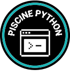

# >_ M2 – Piscine Python

 

  

This project is part of the **42cursus** at 42 Porto.
The Python Piscine is an eleven-module introduction to Python, progressing from basic syntax to OOP, error handling, packaging, functional programming, and data validation.

---

## 🗂️ Modules

| Module | Theme | Description |
|---|---|---|
| [Module 00](./Python%20Module%2000/) | Growing Code | Python fundamentals through garden data management |
| [Module 01](./Python%20Module%2001/) | CodeCultivation | Object-oriented programming through garden systems |
| [Module 02](./Python%20Module%2002/) | Garden Guardian | Exception handling and data engineering for smart agriculture |
| [Module 03](./Python%20Module%2003/) | Data Quest | Python collections, generators, and comprehensions |
| [Module 04](./Python%20Module%2004/) | Data Archivist | File operations, streams, and error handling |
| [Module 05](./Python%20Module%2005/) | Code Nexus | Inheritance, method overriding, and subtype polymorphism |
| [Module 06](./Python%20Module%2006/) | The Alchemist's Codex | Packages, `__init__.py`, and import mechanisms |
| [Module 07](./Python%20Module%2007/) | DataDeck | Abstract classes and card-game architecture |
| [Module 08](./Python%20Module%2008/) | The Matrix | Data engineering and matrix analysis |
| [Module 09](./Python%20Module%2009/) | Cosmic Data Observatory | Pydantic models and data validation |
| [Module 10](./Python%20Module%2010/) | FuncMage Chronicles | Functional programming: lambdas, scope, functools, decorators |

---

## 📝 License & credits

* **Curriculum:** [42 Porto](https://www.42network.org/campus/42-porto/)

> *This project is part of the 42 Student Network curriculum.*
