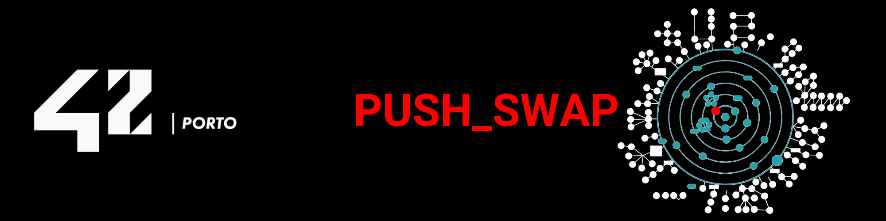

<div align="center">

# 🔄 M2 – push_swap


<br/>


<p align="center">
  
</p>

This project is part of the **42cursus** at 42 Porto.  
The goal is to sort a stack of integers using a limited set of operations, with the smallest number of moves possible. This project introduces **sorting algorithms**, **algorithm complexity**, and **optimization**.

</div>

---

## 🎯 Objectives

- Implement an efficient sorting algorithm using two stacks and a restricted set of operations.
- Understand and apply concepts of **algorithm complexity** (Big O notation).
- Practice cost analysis and optimization to minimize the number of operations.
- Handle edge cases and error management robustly.
- Provide clean, Norm-compliant C code.

---

## 🧱 Project structure

```text
push_swap/
├── push_swap.h              # Main header with struct and prototypes
├── Makefile                 # Builds push_swap (mandatory) and checker (bonus)
├── main.c                   # Entry point for push_swap
├── handle_errors.c          # Input validation and error handling
├── stack_init.c             # Stack initialization and push preparation
├── stack_utils.c            # Stack utility functions (len, find min/max, etc.)
├── push.c                   # pa / pb operations
├── swap.c                   # sa / sb / ss operations
├── rotate.c                 # ra / rb / rr operations
├── rev_rotate.c             # rra / rrb / rrr operations
├── sort_three.c             # Sorting algorithm for 3 elements
├── sort_stacks.c            # Main sorting algorithm (Turk sort)
├── init_a_to_b.c            # Node initialization for a → b phase
├── init_b_to_a.c            # Node initialization for b → a phase
├── ft_split.c               # Custom split for string argument handling
├── ft_utils.c               # ft_atol helper
├── checker.c                # Bonus: checker program
├── get_next_line.h          # GNL header (used by checker)
├── get_next_line.c          # GNL main logic (used by checker)
├── get_next_line_utils.c    # GNL helpers (used by checker)
├── tester/                  # Push_swap tester (see tester/README.md)
└── README.md                # this file
```

---

## 📝 Available operations

The program uses two stacks (**a** and **b**) and the following operations:

### 🔄 Swap

| Operation | Description |
| :--- | :--- |
| `sa` | Swap the first two elements at the top of stack **a** |
| `sb` | Swap the first two elements at the top of stack **b** |
| `ss` | `sa` and `sb` at the same time |

### ⬆️ Push

| Operation | Description |
| :--- | :--- |
| `pa` | Push the top element of **b** onto **a** |
| `pb` | Push the top element of **a** onto **b** |

### 🔃 Rotate

| Operation | Description |
| :--- | :--- |
| `ra` | Rotate **a** up: first element becomes last |
| `rb` | Rotate **b** up: first element becomes last |
| `rr` | `ra` and `rb` at the same time |

### 🔄 Reverse Rotate

| Operation | Description |
| :--- | :--- |
| `rra` | Reverse rotate **a**: last element becomes first |
| `rrb` | Reverse rotate **b**: last element becomes first |
| `rrr` | `rra` and `rrb` at the same time |

---

## 🧠 The algorithm

This implementation uses the **Turk sort** algorithm, a cost-based approach:

1. **Push to B**: Push all elements except 3 from stack **a** to stack **b**, targeting the closest smaller value in **b** for each element.
2. **Sort three**: Sort the remaining 3 elements in **a** using at most 2 operations.
3. **Push back to A**: Push elements from **b** back to **a**, each time finding its correct target position.
4. **Final rotation**: Rotate **a** to bring the minimum to the top.

The cost analysis accounts for simultaneous rotations (`rr` / `rrr`) when both the source and target nodes are on the same side of their respective stacks, using `max(cost_a, cost_b)` instead of `cost_a + cost_b`.

### ⚡ Performance

| Stack size | Average moves | Threshold for max grade |
| :--- | :--- | :--- |
| 3 | ≤ 2 | 3 |
| 5 | ≤ 12 | 12 |
| 100 | ~560 | < 700 |
| 500 | ~5100 | < 5500 |

---

## ➕ Bonus – Checker

The bonus part implements a `checker` program that:

1. Takes the same arguments as `push_swap`.
2. Reads sorting instructions from standard input (one per line).
3. Applies them to the stack.
4. Prints `OK` if the stack is sorted after all operations, `KO` otherwise.
5. Prints `Error` on invalid input (bad arguments or unknown instruction).

```bash
# Verify push_swap output with checker
./push_swap 3 2 1 | ./checker 3 2 1
# Output: OK
```

---

## 🛠️ Building the project

From inside the project root:

```bash
# build mandatory part (push_swap)
make

# build bonus part (checker)
make bonus

# remove object files
make clean

# remove objects + binaries
make fclean

# full rebuild
make re

# check for memory leaks with Valgrind
make valgrind ARGS="4 67 3 87 23"
```

This produces:

```text
push_swap   # the sorting program
checker     # the bonus checker program
```

---

## 🚀 Usage

```bash
# Multiple arguments
./push_swap 4 67 3 87 23

# Single string argument
./push_swap "4 67 3 87 23"

# Count the number of operations
./push_swap 4 67 3 87 23 | wc -l

# Verify with checker
./push_swap 4 67 3 87 23 | ./checker 4 67 3 87 23

# Generate random numbers and test
ARG=$(shuf -i 1-500 -n 100 | tr '\n' ' '); ./push_swap $ARG | wc -l

# Generate random negative numbers and test
ARG=$(shuf -i 1-500 -n 100 | sed 's/^/-/' | tr '\n' ' '); ./push_swap $ARG | wc -l
```

---

## ⚠️ Error handling

The program handles the following error cases by writing `Error\n` to stderr:

- Non-numeric arguments
- Duplicate numbers
- Numbers exceeding `INT_MAX` or below `INT_MIN`
- Invalid signs (`+` or `-` alone)

No arguments or an empty string argument produces no output.

---

## 🧪 Testing

There is a dedicated tester in:

```text
push_swap/tester/
```

It runs identity tests, small sort tests, error handling tests, performance benchmarks (100 and 500 elements), and bonus checker tests.  
See [`tester/README.md`](tester/README.md) for usage instructions.

---

## ✅ Code style & requirements

- Follows **42 Norm**.
- Compiled with:

```bash
cc -Wall -Wextra -Werror
```

- No forbidden functions beyond project subject.
- All dynamically allocated memory is properly freed (verified with Valgrind — 0 leaks). Use `make valgrind ARGS="..."` to check.
- Uses a doubly-linked list for efficient stack operations.

---

## 🛠️ Tech stack

<div align="center">

<table width="100%">
    <thead>
        <tr>
            <th width="80%">Category</th>
            <th width="80%">Technologies</th>
        </tr>
    </thead>
    <tbody>
        <tr>
            <td align="center"><b>Core</b></td>
            <td>
                
            </td>
        </tr>
        <tr>
            <td align="center"><b>Build System</b></td>
            <td>
                
            </td>
        </tr>
        <tr>
            <td align="center"><b>Tools</b></td>
            <td>
                
                
            </td>
        </tr>
    </tbody>
</table>

</div>

---

## 📝 License & credits

* **Curriculum:** [42 Porto](https://www.42network.org/campus/42-porto/)

> *This project is part of the 42 Student Network curriculum.*
