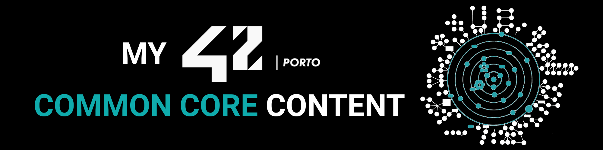

# 🎓 42 Common Core

 

My personal progress through the **42 Porto** Common Core curriculum: every
project, exam, and milestone from Libft through the final ranks.

---

## 🗂️ Repository layout

| Folder | Contents |
|---|---|
| [`Projects/`](./Projects/) | Every Common Core project, one folder per project, organised by milestone |
| [`Exams/`](./Exams/) | Exam study materials and solutions, one folder per exam rank |

---

## 📌 Milestone progress

| Milestone | Projects | Status |
|---|---|---|
| 0 | Libft | ✅ |
| 1 | Born2beroot · ft_printf · get_next_line | ✅ |
| 2 | A-Maze-ing · Piscine Python · push_swap | ✅ |
| 3 | Call Me Maybe · Codexion · Fly-in | 🔷 In progress |
| 4 | NetPractice · Pac-Man · RAG against the machine | 🔒 |
| 5 | Agent Smith · Inception · The Answer Protocol | 🔒 |
| 6 | 42_Collaborative_resume · ft_transcendence | 🔒 |

> Each milestone must be validated before unlocking the next. See
> [`Projects/README.md`](./Projects/README.md) for the full project list and
> [`Exams/README.md`](./Exams/README.md) for exam details.

---

## 📝 License & credits

* **Curriculum:** [42 Porto](https://www.42network.org/campus/42-porto/)

> *This repository is part of the 42 Student Network curriculum.*
